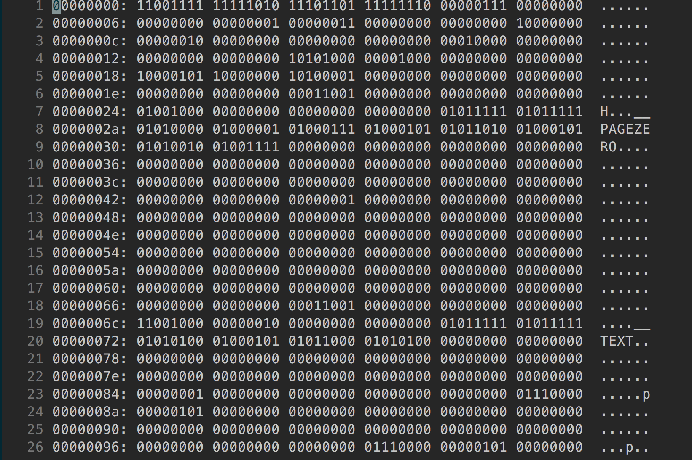

# Qu'est ce qu'un fichier binaire ?

J'ai écrit que Rust se compile en un fichier binaire. Mais qu'est ce qu'un fichier binaire précisément ?

> ⬆️ ci-dessus un extrait d'un fichier binaire de Rust obtenu avec la commande `xxd -b filename`

Quand on compile Rust, on obtient un fichier qui contient des `0` et des `1` , que l'ordinateur est en mesure de comprendre et éxécuter pour que le programme fasse ce pourquoi il a été développé.
